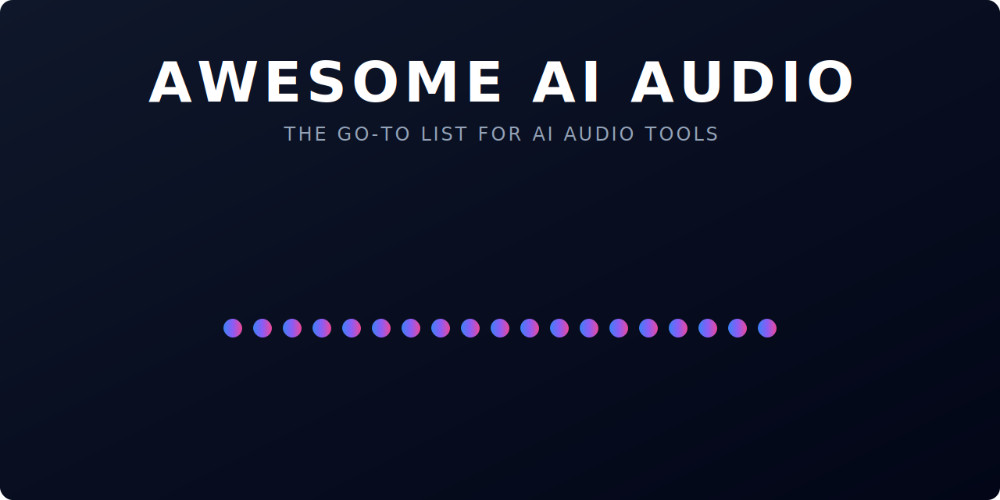

  

## I want to?

| I want to... | Go here |
|---|---|
| Make a full song from scratch | [Creation & Production](#creation--production) |
| Clone or transform a voice | [AI Voice & Cover Generation](#ai-voice--cover-generation) |
| Remove vocals from a track | [Source Separation](#source-separation) |
| Make a podcast | [Radio & Podcast](#radio--podcast) |
| Use audio for health/medicine | [Health & Wellbeing](#health--wellbeing) |
| Build an audio AI app | [Development](#development) |

## Quick Navigation

| | | | |
|---|---|---|---|
| [Creation & Production](#creation--production) | [Lyric Writing](#lyric-writing--songwriting) | [Voice Covers](#ai-voice--cover-generation) | [Separation](#source-separation) |
| [Mastering](#mastering-mixing--production-analysis) | [Plugins](#plugins--sample-tools) | [Analysis](#analysis--recommendation) | [Health](#health--wellbeing) |
| [Podcast](#radio--podcast) | [Hearing](#hearing) | [Detection](#sound-detection) | [Speech](#speech) |
| [Transcription](#transcription) | [TTS](#synthesis-tts) | [Enhancement](#enhancement--manipulation) | [Development](#development) |

**Badge Key**

---

## Creation & Production

- [VRS/A](https://vrsa.app)  - AI-powered lyric writing and music production workstation with multi-model Ghostwriter, Suno integration via browser extension, audio analysis, album art generation, and VRSA Studio (studio.vrsa.app) for a dedicated production environment.
- [Suno](https://suno.com/)  - Generative AI music creation platform that allows users to create full songs, including vocals and instrumentation, from text prompts.
- [Soundry AI](https://soundry.ai/)  - AI for Musicians, by Musicians.
- [Sonauto](https://sonauto.ai/Home)  - Create hit songs with AI.
- [Microphone Studio](https://microphonestudio.app)  - Multi-track recording without expensive studio equipment.
- [TuneFlow](https://tuneflow.com/)   - Generate lyrics, melody, drum beats and more, while editing and mixing like any professional DAW.
- [CassetteAI](https://cassetteAI.com)  - AI powered music production platform: make lyrics, beats & vocals with AI then mix & publish straight from Cassette.
- [AIVA](https://www.aiva.ai)  - The Artificial Intelligence composing emotional soundtrack music.
- [beatoven.ai](https://www.beatoven.ai)  - A simplified music creation tool that helps you create music for your videos and podcasts.
- [Infinite Album](https://www.infinitealbum.io)  - Adaptive AI music for gamers who livestream.
- [Epidemic Sound](https://www.epidemicsound.com)  - High quality music and sound effects for all your content, all rights included.
- [Wonder](https://www.wonder.inc)  - Dynascore: The world's first Dynamic Music Engine.
- [Amper](https://www.ampermusic.com/)  _(Acquired by Shutterstock)_ - AI Music Composition Tools for Content Creators.
- [AudioStack](https://www.audiostack.ai)   - AI-first platform for producing audio at scale.
- [mayk.it](https://www.mayk.it/)  - Your virtual music studio.
- [boomy](https://boomy.com/)  - Make instant music, share it with the world.
- [enote](https://enote.com)  - Intelligent Sheet Music.
- [Qosmo](https://qosmo.jp/en/) - Qosmo is a group of artists, researchers, designers, and programmers.
- [AI Music](http://www.aimusic.co.uk/)  _(Acquired by Apple)_ - Our music helps brands enable deeper connections with their audiences.
- [Splash HQ](https://www.splashcorporate.com/) - The next generation of music producers.
- [musico](https://www.musi-co.com/) - AI-driven software engine that generates music. It can react to gesture, movement, code or other sound.
- [Yousician](https://yousician.com/)  - The largest music educator on the planet.
- [Tape It](https://tape.it/)  - App for songwriting & audio recording.
- [sessionwire](http://sessionwire.com)  - All-in-one online collaboration platform that delivers a seamless studio experience.
- [Aflorithmic](https://www.aflorithmic.ai)   - Professional audio, voice, sound and music to scale.
- [Audio Design Desk](https://add.app)  - The Audio Solution for Video Editors.
- [Never Before Heard Sounds](https://heardsounds.com)  - A music studio powered by AI.
- [NeuralDSP](https://neuraldsp.com)   - Empowers music players by democratizing the access to world-class sound, through an intuitive software/hardware ecosystem.
- [Neutone](https://neutone.space/)   - AI audio plugin & community bridging the gap between AI research and creativity.
- [Udio](https://www.udio.com)  - AI music generator with full song creation from text prompts, integrated lyric editor, and granular line-by-line vocal control.
- [Mureka](https://www.mureka.ai/)  - AI music generation with style-reference input, vocal timbre selection, and voice cloning for demos and song prototyping.
- [Soundverse](https://soundverse.ai)  - Full-suite AI music studio with text-to-song, beat generation, stem separation, and SAAR — a voice-controlled music production assistant.
- [ACE Studio](https://acestudio.ai)  - All-in-one AI music studio with expressive AI vocals, natural-sounding AI instruments, and a DAW bridge for Logic, Ableton, and FL Studio.
- [Stable Audio](https://stability.ai/stable-audio)  - Text-to-audio and audio-to-audio generation for music and sound effects from Stability AI, trained on licensed datasets.
- [Riffusion](https://www.riffusion.com/)   - Diffusion model-based real-time music generation from text prompts, operating directly on audio spectrograms.
- [LoudMe](https://loudme.ai/)  - Text-to-music generator for royalty-free songs and instrumentals with style and mood controls.
- [Ecrett Music](https://ecrettmusic.com/)  - Scene and mood-based AI background music generator aimed at video and content creators requiring instant scoring.
- [Soundful](https://soundful.com/)  - AI platform for generating royalty-free, high-quality soundtracks customizable by mood, tempo, and brand identity for commercial use.
- [SongGPT](https://songgpt.com/)  - AI song generator for producing full tracks from short text prompts with genre selection.
- [Tunee](https://tunee.ai/)  - AI music and lyric generation platform with access to multiple underlying generative models for varied output styles.
- [LOVO](https://lovo.ai/)   - Advanced text-to-speech and voice cloning platform for content creators, supporting emotional range control and voice actor-style production.

 

## Lyric Writing & Songwriting

- [VRS/A](https://vrsa.app)  - AI-powered lyric writing and music production workstation with multi-model Ghostwriter, Suno integration via browser extension, audio analysis, album art generation, and VRSA Studio.
- [Lyric Studio](https://www.lyricstudio.co/)  - Mobile-first AI songwriting ecosystem with a lyric editor, AI-generated verse/chorus drafts, rhyme suggestions, and song organization tools.

## AI Voice & Cover Generation

- [Jammable](https://www.jammable.com)  - (formerly Voicify AI) AI song cover generator with 22,000+ community-uploaded voice models and custom voice cloning from 10 minutes of audio.
- [Musicfy](https://musicfy.lol)  - AI voice covers and voice cloning platform with text-to-music generation, voice-to-instrument conversion, and a large copyright-free vocal library.
- [Lalals](https://lalals.com/)  - AI voice swapping tool suite with 1,000+ voice options, stem splitting, and real-time conversion for remixes and vocal experimentation.

## Source Separation

- [Music AI](https://musicai.audio/)   - Professional AI stem separation and audio analysis platform for broadcasters and remixers, partnered with SourceAudio's 140+ broadcaster network.
- [TuneFlow](https://tuneflow.com/)  - A free DAW offering high quality vocal, drums, melody, bass stem separation, all-in-one audio separation, editing and vocal/instrument to MIDI transcription.
- [Spliter.ai](https://splitter.ai/)  - AI Audio Processing.
- [Gaudio](https://www.gaudiolab.com/)   - Redefine your audio experience in music/video streaming and virtual/augmented reality.
- [AudioShake](https://www.audioshake.ai)   - An On-Demand Stem Creation Platform for the Music Industry.
- [Audionamix](https://audionamix.com/)  - Audio separation solutions for the entertainment industry.
- [vocali.se](https://vocali.se/en)  - Separate vocals and music from any song, in seconds.
- [lalal.ai](https://www.lalal.ai/)  - High-quality stem splitting based on the world's #1 AI-powered technology.
- [VocalRemover](https://vocalremover.org/)  - Separate voice from music out of a song free with powerful AI algorithms.
- [PhonicMind](https://phonicmind.com/)  - Separate vocals, drums, bass and other instruments out of your songs with HiFi AI.
- [EasySplitter](https://easysplitter.com/)  - AI-Based Vocal Remover Online for DJ Singers.
- [Remover.studio](https://vocalremover.co)  - Vocal Remover & Online Karaoke.
- [MVSep](https://mvsep.com/)  - Free separation of songs with many different algorithms (Demucs, MDX, UVR etc).
- [MuzLab](https://muzlab.co/)  - Remove vocals from songs and split drums, bass and other instruments out of music.
- [Fadr](https://fadr.com/)  - Remove stems, convert to MIDI, and create high-quality remixes and mashups using AI tools.

## Mastering, Mixing & Production Analysis

- [SoundBoost AI](https://soundboostai.com/)  - AI music mastering platform with goal-based controls — specify targets like loudness, warmth, or punch and the engine applies processing automatically.
- [VerifAI Audio](https://verifai.audio/)  - Instant AI-driven feedback on track quality covering mixdown balance, loudness levels, bitrate, and other release-readiness metrics.

## Plugins & Sample Tools

- [Samplab](https://samplab.com/)   - AI VST plugin for granular audio sample editing, enabling note-level pitch manipulation of polyphonic audio with automatic chord progression detection.
- [Slooply](https://slooply.com/)  - AI-powered sample discovery platform with similarity search, mood/key/BPM filtering, MIDI export, and direct drag-and-drop DAW integration.
- [Atlas](https://atlasaudio.com/)  - AI sample library organizer with auto-tagging, similar-sound search, and a smart drum map interface for large sample collections.
- [Playbeat](https://www.audiomodern.com/app/playbeat/)   - AI generative groove sequencer for instant beat creation with MIDI export and real-time DAW sync.

## Analysis & Recommendation

- [SONOTELLER](https://sonoteller.ai)  - AI music analysis tool for song lyric summarization, theme extraction, and musical feature identification.
- [Musicful](https://musicful.ai/)  - AI-powered music recommendation and discovery engine focused on contextual and emotional matching.
- [Harmix](https://harmix.ai/)  - AI music search with natural language, videos, similar audio and lyrics. Auto-tagging for audio and video.
- [AIMS](https://aimsapi.com)   - AI-powered music similarity search & auto-tagging for anyone who makes music discovery their business.
- [FeedForward](https://www.feedforwardai.com)   - The intuitive audio search engine for audio & sound catalogues.
- [Aimi](https://www.aimi.fm)  - Discover the artists who freed their music from the shackles of songs and playlists.
- [Utopia Music](https://utopiamusic.com)  - Fair Pay for Every Play.
- [Musiio](https://www.musiio.com)  _(Acquired by SoundCloud)_ - Use Artificial Intelligence to help automate your workflows.
- [niland](https://niland.io/)  _(Acquired by Spotify)_ - Build AI Powered Music Apps.
- [cyanite](https://cyanite.ai/)   - AI for Music tagging and similarity search.
- [musicube](https://www.musicu.be/en/)  _(Acquired by SongTradr)_ - B2B AI music metadata services like auto-tagging, metadata enrichment and semantic search.
- [Musixmatch](https://www.musixmatch.com/)   - Algorithms and tools for music discovery, recommendation, and search based on lyrics.
- [hoopr](https://www.hoopr.ai)  - Find the best music, tell better stories, grow your audience.
- [Pex](https://www.pex.com)   - Music identification and copyright compliance. Audio fingerprinting, cover song identification in large scale.

## Health & Wellbeing

- [Endel](https://endel.io)  - Personalized soundscapes to help you focus, relax, and sleep.
- [Lucid](https://www.thelucidproject.ca) - Transforming music into medicine, using AI to compose and curate a personalized therapeutic music experience.
- [Wavepaths](https://wavepaths.com)  - Music for Psychedelic Therapy.
- [Suki](https://www.suki.ai/)  - AI-powered voice solutions for healthcare.
- [audEERING](https://www.audeering.com/)   - Technology that can detect emotions and health information from the voice.
- [brain.fm](https://www.brain.fm/)  - Music to Focus Better.
- [SPOKE](https://www.spoke.world/)  - Lo-fi & Lyricism-led Mindfulness music episodes.
- [sona](https://sona.care/) - Music as medicine. Research-based music for anxiety made by Grammy-winning producers.
- [Novoic](https://novoic.com/)  - Using speech to detect neurological diseases.
- [Ubenwa](https://www.ubenwa.ai)  - Infant health analysis based on cry signals.
  
# Radio / Podcast

- [faidr](https://faidr.com)  - Your favorite radio, interruption free.
- [fathom](https://hello.fathom.fm) - The search engine for podcasts.
- [Nomono](https://nomono.co)   - A self-contained recording kit for capturing interviews in the field.
- [Descript](https://www.descript.com)  - All-in-one audio & video editing, as easy as a doc.
- [auphonic](https://auphonic.com)  - Automatic audio post production web service for podcasts, broadcasters, radio shows, movies, screencasts and more.
- [SimonSays](https://www.simonsaysai.com/)  - Edit Video 5x Faster, Built For Teams.
- [Podcastle](https://podcastle.ai/)  - Studio-quality recording, AI-powered editing, and seamless exporting.
- [cleanvoice](https://cleanvoice.ai/)  - Removes filler sounds, stuttering and mouth sounds from your podcast or audio recording.
- [Super Hi-Fi](https://www.superhifi.com/)  - Artificial Intelligence Powered Music Experiences.

# Hearing

- [Whisper.ai](https://whisper.ai)   - Smarter than your average hearing aid.
- [Eargo](https://www.eargo.com)   - A Revolutionary New Hearing Aid.
- [Concha Labs](https://conchalabs.com/)  - Helping you hear more clearly.

# Sound detection

- [Audio Analytic](https://www.audioanalytic.com/)   - Creating exceptional human experiences through a greater sense of hearing.
- [SoundEye](https://sound-eye.com/)  - Advanced sound recognition solutions capable of classifying sounds such as screaming, gunshot, coughing, and crying.
- [cochl](https://www.cochl.ai/)   - A next-generation sound AI platform that understands any sounds like a human.
- [Josh.ai](https://www.josh.ai/)  - A voice-controlled home automation system.
- [SEE SOUND](https://www.see-sound.com/)  - The world's first smart home hearing system.
- [Epigos.ai](https://www.epigos.ai/)  - AI models that can be used to extract hidden data from audio sources.
- [HyperSurfaces](https://www.hypersurfaces.com/)  - Seamlessly merging the physical and data worlds without the need for keyboards, buttons or touch screens.
- [HyperSentience](https://hypersentience.ai)  - Delivers context awareness to phones, VR/AR headsets, smart watches, speakers and laptops.
- [Circulr Sound](https://www.circulrsound.com/)  - Smart audio wearables.
- [Securaxis](https://www.securaxis.com/)  - We turn sounds into information.
- [Deeply](https://deeplyinc.com)   - We add meaning to every sound in the world using advanced deep learning technology for sound event detection and context recognition.
- [Reef Pulse](https://reef-pulse.com) - Coral reef monitoring using bioacoustics and AI: sound event detection (boats, divers, waves, marine mammals, fishes, invertebrates) for impactful management of marine ecosystems.

# Speech

## Transcription

- [Ava](https://www.ava.me)  - Professional and AI-Based Captions for Deaf and HoH (Transcription & Diarization).
- [verbit](https://verbit.ai/)  - Professional AI-Based Transcription & Captioning.
- [otter](https://otter.ai/)  - Everything hybrid teams need for productive, collaborative meetings.
- [Trint](https://trint.com/)  - Audio Transcription Software — Speech to Text to Magic.
- [Rev](https://rev.com)  - 99% accurate captions, transcripts, and subtitles.
- [voiceitt](https://voiceitt.com/) - An app for people with non-standard speech.
- [deepgram.com](https://deepgram.com/)   - Better voice applications with faster, more accurate transcription through AI Speech Recognition.
- [fireflies.ai](https://fireflies.ai/)  - AI assistant for your meetings.
- [SoapBox](https://www.soapboxlabs.com/)   - Speech technology that makes kids heard.
- [Amberscript](https://www.amberscript.com/en/)  - SaaS solutions that automatically transform audio and video into text and subtitles using speech recognition.
- [Speaksee](https://speak-see.com/) - Live captions what's being said during in-person group meetings.
- [Speechmatics](https://www.speechmatics.com/)   - Autonomous Speech Recognition technology that understands every voice.
- [sonix](https://sonix.ai/)  - Automated transcription in 35+ languages.
- [Picovoice](https://picovoice.ai/)    - End-to-end Edge Voice AI, on-device voice recognition.
- [BoldVoice](https://www.boldvoice.com/)  - Speak English clearly and confidently.
- [Gladia](https://www.gladia.io)   - Power your product with cutting-edge AI transcription, translation and audio intelligence using a single API.
- [Podsqueeze](https://podsqueeze.com)  - Re-purpose your audio or video podcast into transcript, show notes, blog post, video clips and other assets to publish and promote your show.

## Synthesis (TTS)

- [adauris.ai](https://www.adauris.ai)  - Transforming written content into engaging audio with seamless distribution.
- [Aflorithmic](https://www.aflorithmic.ai)   - Professional audio, voice, sound and music to scale.
- [Sonantic](https://www.sonantic.io)  _(Acquired by Spotify)_ - Deliver compelling, lifelike performances with fully expressive AI-generated voices.
- [kroop AI](https://www.kroop.ai) - Harness synthetic media generation and detection with endless possibilities.
- [dubverse](https://dubverse.ai)  - Make your content multilingual at a click of a button and reach more people.
- [Resemble.ai](https://www.resemble.ai)   - Generate AI Voices that sound real.
- [Replica](https://replicastudios.com)  - AI voice actors for games, film & the metaverse.
- [Respeecher](https://www.respeecher.com)  - Voice Cloning for Content Creators.
- [amai](https://amai.io/) - Ultra realistic text to speech voice engines.
- [AssemblyAI](https://www.assemblyai.com)   - Transcribe and understand audio with a single AI-powered API.
- [DAISYS](https://daisys.ai/) - New voices that sound like real people.
- [WellSaid](https://wellsaidlabs.com/)  - Text-to-speech technology that creates life-like synthetic voices, from the voices of real people.
- [Deepsync](https://deepsync.co/) - Generate audio content that exactly sounds like you.
- [coqui.ai](https://coqui.ai/)  - Providing open speech tech for everyone.
- [Voiseed](https://voiseed.com/) - AI-based Voice Engine able to mimic the emotions and prosody of human speech.
- [Speechki](https://speechki.io)  - NLP-based text and audio editing platform with hundreds of AI voices inside.
- [Jellypod](https://jellypod.ai)  - The AI podcast studio. Create customizable AI podcasts in minutes.
- [MiSynth](https://www.misynth.io) - A brain-controlled instrument that uses synaptic technology and BCIs to turn imagined sounds into a synthesized MIDI instrument.
- [ElevenLabs](https://beta.elevenlabs.io/)   - Developing the most compelling AI speech software for publishers and creators.
- [Wondercraft](https://www.wondercraft.ai/)  - Wondercraft enables users to generate podcasts using Text-to-Speech technology.
- [play.ht](https://play.ht/)   - Building the future of content creation based on generative machine learning models.
- [Revocalize.ai](https://www.revocalize.ai)  - Generate studio-quality AI Voices and train AI voice models from the web dashboard or the VST plugin.
- [morpheme.ai](https://www.morpheme.ai) - Actor-First, Digital-Double Voices powered by the latest AI technology, ensuring they are efficient, authentic, and ethical.

## Enhancement & Manipulation

- [Meaning](https://www.meaning.team/) - Streaming real-time voice and accent conversion.
- [VideoDubber](https://videodubber.ai/)  - Translating video/audio through voice cloning and accent conversion in 150+ languages.
- [krisp](https://krisp.ai/)  - An AI-powered software solution for effective online meetings.
- [voicemod](https://www.voicemod.net/)  - Free real-time voice changer.
- [audo](https://audo.ai/)   - Noise cancellation products for creators, developers, and virtual meetings.
- [AudioTelligence](https://audiotelligence.com/)   - Software that transforms the clarity and intelligibility of speech in challenging acoustic environments.
- [immersitech.io](https://immersitech.io/)  - We don't make audio. We make audio better.
- [utterly](https://www.utterly.app/)  - Noise removal for meetings and audio.
- [claerity.ai](https://www.claerity.ai/)  - Cutting-edge AI to eliminate all background noise on video conference calls.
- [Neural Love](https://neural.love/audio)  - Set of AI-powered tools to enhance audio quality.
- [HeardThat](https://www.heardthatapp.com/)  - A smartphone app that turns your smartphone into a sophisticated speech-enhancement device.
- [Chatable](https://chatableapps.com)  - A smartphone app that removes disruptive background noise.
- [BdSound](https://www.bdsound.com/)  - Intelligent Audio Solution for audio and voice-enabled products.
- [echosonic](https://www.echosonic.ca/) - Revolutionizing microphone by bringing Machine Learning capabilities into it.
- [Insoundz](https://insoundz.com/)  - Generative AI Audio Enhancement.
- [Xound](https://xound.io/)  - AI-powered audio enhancements in just one click. Grammarly for audio.

# Development
## Tools & SDKs

- [Quilio](https://www.quilio.dev/)  - We maintain tools to help developers build real-time audio AI applications with ease.

---

# Contributing

Fork the repo, edit the README, and open a PR.
